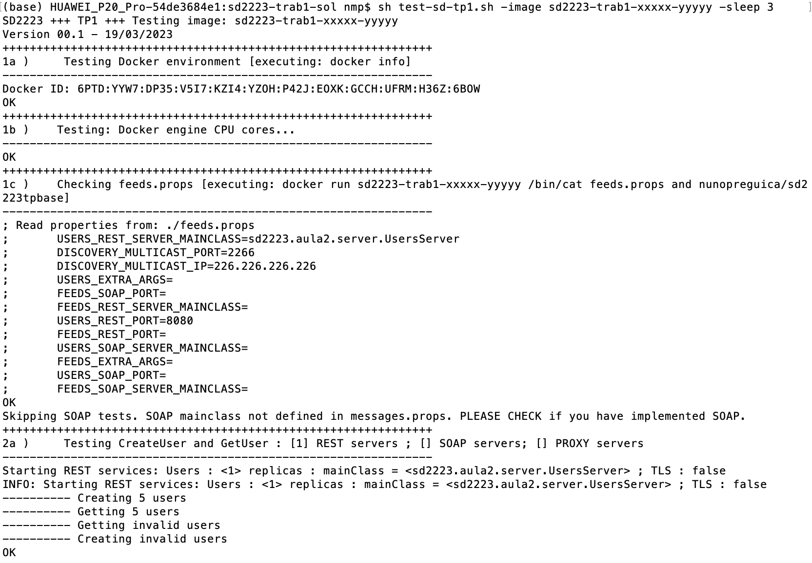
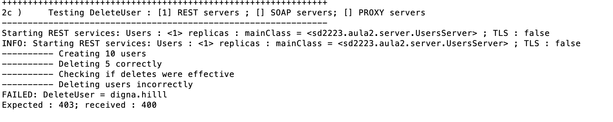
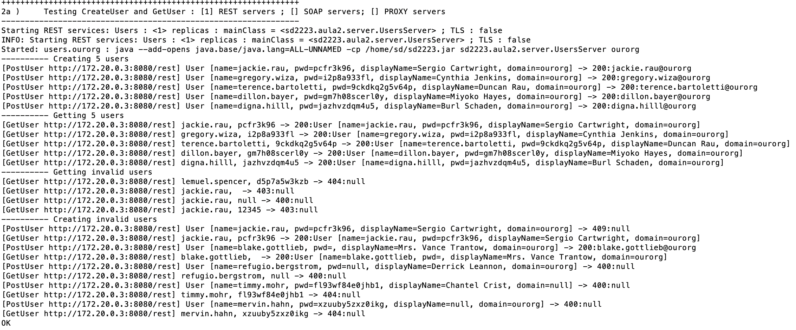

## Trabalho 1 - *Tester*

O *Tester* tem como objetivo permitir o teste do trabalho prático 1, de forma sistemática e uniforme para todos os grupos.
Os alunos poderão testar a correção da sua implementação, usando o *Tester*.

Para executar o tester, os alunos com sistemas operativos Linux ou MacOS devem usar o script 
[test-sd-tp1.sh](https://raw.githubusercontent.com/jcleitao/sd2425-proj-api/refs/heads/main/test-sd-tp1.sh),
enquanto que os alunos com Windows devem usar o script [test-sd-tp1.bat](https://raw.githubusercontent.com/jcleitao/sd2425-proj-api/refs/heads/main/test-sd-tp1.bat).
<br>

**Nota**: Todos os ficheiros mencionados estão dispopíveis em:
[https://github.com/jcleitao/sd2425-proj-api](https://github.com/jcleitao/sd2425-proj-api).
 
### Preparação
Antes de executar o tester e criar a imagem docker, devem adicionar e atualizar o 
fichero [fctreddit.props]([https://github.com/preguica/sd2324-proj-api/blob/main/shorts.props](https://raw.githubusercontent.com/jcleitao/sd2425-proj-api/refs/heads/main/fctreddit.props)) 
na raiz do vosso projeto com a informação correta:


```
USERS_REST_SERVER_MAINCLASS=classe do servidor Users REST (e.g. sd2425.tp1.server.RESTUsersServer)
USERS_REST_PORT=porto do servidor Users REST (e.g. 8080)
USERS_REST_EXTRA_ARGS=parâmetro adicional a passar ao servidor Users REST, se algum
CONTENT_REST_SERVER_MAINCLASS=classe do servidor Content REST 
CONTENT_REST_PORT=porto do servidor Content REST
CONTENT_REST_EXTRA_ARGS=parâmetro adicional a passar ao servidor Content REST, se algum
IMAGE_REST_SERVER_MAINCLASS=classe do servidor Image REST 
IMAGE_REST_PORT=porto do servidor Image REST
IMAGE_REST_EXTRA_ARGS=parâmetro adicional a passar ao servidor Image REST, se algum
USERS_GRPC_SERVER_MAINCLASS=classe do servidor Users GPRC 
USERS_GRPC_PORT=porto do servidor Users GRPC
USERS_GRPC_EXTRA_ARGS=parâmetro adicional a passar ao servidor Users GRPC, se algum
CONTENT_GRPC_SERVER_MAINCLASS=classe do servidor Content GRPC 
CONTENT_GRPC_PORT=porto do servidor Content GRPC
CONTENT_GRPC_EXTRA_ARGS=parâmetro adicional a passar ao servidor Content GRPC, se algum
IMAGE_GRPC_SERVER_MAINCLASS=classe do servidor Image GRPC 
IMAGE_GRPC_PORT=porto do servidor Image GRPC
IMAGE_GRPC_EXTRA_ARGS=parâmetro adicional a passar ao servidor Image GRPC, se algum
DISCOVERY_MULTICAST_IP=endereço multicast para descoberta (e.g. 226.226.226.226)
DISCOVERY_MULTICAST_PORT=porto para descoberta (e.g. 2266)
```

Enquanto não tiverem a parte GRPC implementada, devem deixar as propriedades respetivas sem nenhum valor, mas não as devem apagar.
Podem igualmente testar o servidor ***Users*** sem terem os servidores ***Content*** e ***Image*** funcionais, deixando as respetivas propriedades sem
nenhum valor.

Devem usar o ficheiro **Dockerfile** presente no repositório das interfaces,
presente no seguinte link: [Dockerfile](https://raw.githubusercontent.com/jcleitao/sd2425-proj-api/refs/heads/main/Dockerfile), 
o qual necessita do ficheiro de configuração do Hibernate 
[hibernate.cfg.xml](https://raw.githubusercontent.com/jcleitao/sd2425-proj-api/refs/heads/main/hibernate.cfg.xml), convenientemente parametrizado.

Sugere-se que usem o ficheiro [pom.xml](https://github.com/jcleitao/sd2425-proj-api/blob/main/pom.xml) que se encontra no repositório, como ponto de partida.


**Sempre que alterarem o vosso trabalho (incluindo o ficheiro fctreddit.props)** devem criar 
uma nova imagem Docker do vosso trabalho (usando o projeto Maven disponibilizado, 
tal consiste em executar: `mvn clean compile assembly:single docker:build`).


**NOTA:** Em algumas versões do Docker, o docker:build pode não funcionar. Nesse caso, devem criar
a imagem usando os seguintes comandos:
```
mvn clean compile assembly:single
docker build -t sd2425-trab1-XXXXX-YYYYY .
```

Nota: Substituir XXXXX-YYYYY pelos números de aluno do grupo. Remover -YYYYY, se o grupo for individual, inclusivamente no pom.xml.
### Execução dos testes

Para executar o *Tester*, basta executar o seguinte comando, 
usando o nome da imagem do vosso trabalho (**substituir sd2425-trab1-xxxxx-yyyyy pelo 
nome da vossa imagem**):

```
Linux / MacOS
sh test-sd-tp1.sh -image sd2425-trab1-xxxxx-yyyyy
```
```
Windows
test-sd-tp1.bat -image sd2425-trab1-xxxxx-yyyyy
```
*NOTA:* há uma secção sobre problemas com a execução deste comando mais tarde neste documento.

O *Tester*, ao executar, corre uma série de passos, indicando genericamente 
as verificações que está a efetuar. 
Caso os testes de cada fase corram corretamente, no fim de cada fase 
aparece a mensagem OK. 

Exemplo de uma execução correta (truncada):



Caso um teste falhe, apresenta informação de qual o erro que ocorreu, indicando o resultado recebido do vosso trabalho e qual o resultado esperado. Adicionalmente, serão apresentadas as menssagens escritas pelo vosso programa para o output.

Exemplo de uma execução com um erro (em que se pode ver que se esperaria o código 403 e se recebeu o código 404 na execução dum DeleteUser):




### Outras opções do *Tester*

O *Tester* possui algumas opções que podem ser especificadas ao corrê-lo, que modificam o seu comportamento.

* **-test \<num\>** : Permite omitir a execução de alguns testes. 
Por exemplo, se passarem o valor **-test 2b**, os testes começarão no 
teste 2b. Esta opção é útil quando já verificaram que o vosso trabalho 
funciona corretamente até um dado teste e estão a corrigir erros num 
teste específico.
  
* **-sleep \<seconds\>** : Permite diminuir o tempo de espera entre serem 
lançadas os containers com o vosso trabalho e iniciar a execução dos 
testes. Podem ajustar este valor consoante a capacidade do vosso 
computador e as operações que estejam a fazer na fase de inicialização.

<!---
* **-log OFF\|ALL\|FINE\|FINEST** : Permite controlar o nível de mensagens 
gerado pelo programa. Por exemplo, ao usarem a opção **-log FINE**, o 
programa vai indicar todas as operações que está a fazer ao vosso sistema, 
indicando as mensagens recebidas e as esperadas, como se apresenta na 
imagem seguinte:

* **-textsize \<len\>** : Permite indicar a dimensão máxoma do texto das 
mensagens criadas.



-->


### Problemas com o script

Dicas sobre execução no Windows a adicionar brevemente, no entanto se não conseguirem usar o script fornecido num terminal, podem executar o Tester manualmente com o seguinte conjunto de comandos:

Para criar a rede -- a executar uma vez, ou quando a rede *sdnet* tiver sido removida (por exemplo pelo docker system prune):
```
docker network create -d bridge sdnet 
```

Para atualizar a imagem -- a executar sempre que o *Tester* for atualizado:
```
docker pull smduarte/sd2425-tester-tp1
```

Para executar o *Tester* (notem que podem ter de fazer scroll na linha abaixo):
```
docker run --rm --network=sdnet -it -v /var/run/docker.sock:/var/run/docker.sock smduarte/sd2425-tester-tp1:latest -image sd2425-trab1-xxxxx-yyyyy
```

Quem tenha problemas a correr o *Tester*, deve 
fazer um post no ***Discord*** da cadeira, 
com a seguinte informação: dump da mensagem de erro, sistema de operação e versão do 
docker que estão a usar. 
Caso já exista uma mensagem semelhante, façam reply a essa mensagem.

### Códigos de erro

Os códigos de erro que os vossos servidores devolvem devem estar de acordo
com os comentários das respetivas interfaces, disponíveis em: [https://github.com/jcleitao/sd2425-proj-api/tree/main/src/fctreddit/api/java).

### Versões

As versões do *Tester* são incrementais, i.e., a versão N do *Tester* executará todos os testes das versões anteriores.
Nesta secção indicam-se as funcionalidades testadas por cada versão.

#### Versão 1 --ALFA--

##### Testes:
+ **1x** - Testa a integridade do ambiente de teste;
+ **2x** - Testa mecanismo descoberta no serviço **Users**.

<!---
#### Versão 1
Testa as seguintes funcionalidades (REST):
* criação e leitura de utilizadores (2a)
* atualização de utilizadores (2b)
* remoção de utilizadores (2c)
* pesquisa de utilizadores (2d)

#### Versão 3
Testa as seguintes funcionalidades (REST):
* Anúnicos com discovery (3a)
* Shorts only: create, get (4a)
* Shorts only: create, get, get feed, follow/unfollow (4b)
* Shorts only: create, get, get feed, follow/unfollow, delete (4c)
* Shorts only:create, get, get feed, follow/unfollow, like/unlike, delete (4d)
* Shorts+Blobs: create, get (5a)
* Shorts+Blobs: create, get, get feed, follow/unfollow (5b)
* Shorts+Blobs: create, get, get feed, follow/unfollow, delete (5c)
* Shorts+Blobs:create, get, get feed, follow/unfollow, like/unlike, delete (5d)

#### Versão 4
Testa as seguintes funcionalidades com dois servidores de blobs(REST):
* Shorts+Blobs: create, get (6a)
* Shorts+Blobs:create, get, get feed, follow/unfollow, like/unlike, delete (6b)

Testa as seguintes funcionalidades (REST):
* Testa se bloquador de rede funciona (7a)
* Shorts+Blobs com falhas para o users: create, get, get feed, follow/unfollow (7b)

Testa as seguintes funcionalidades (GRPC):
* criação e leitura de utilizadores (9a)
* atualização de utilizadores (9b)
* remoção de utilizadores (9c)
* pesquisa de utilizadores (9d)
* Shorts only: create, get (10a)
* Shorts+Blobs: create, get (10b)
* Shorts+Blobs: create, get, get feed, follow/unfollow (10c)
* Shorts+Blobs:create, get, get feed, follow/unfollow, like/unlike, delete (10d)

#### Versão 5
Testa as seguintes funcionalidades (REST):
* Shorts+Blobs:create, get, get feed, follow/unfollow, like/unlike, delete, delete user (5e)
* Shorts+Blobs com falhas para o shorts: create, get, get feed, follow/unfollow (7c)

Testa as seguintes funcionalidades (mix servidores REST + GRPC):
* Shorts+Blobs: create, get, get feed, follow/unfollow, delete (12a)
* Shorts+Blobs: create, get, get feed, follow/unfollow, delete (12b)
* Shorts+Blobs: create, get, get feed, follow/unfollow, delete (12c)
* Shorts+Blobs: create, get, get feed, follow/unfollow, delete (12d)
* Shorts+Blobs: create, get, get feed, follow/unfollow, delete (12e)

FIX in all tests that use getFeeds and multiple blob servers.

#### Versão 6
Testa as seguintes funcionalidades (REST):
* Users: mix de operações concorrentes (8a)
* Shorts+Blobs: mix de operações concorrentes (8b)
* Users+Shorts+Blobs: mix de operações concorrentes (8c)
* Shorts+Blobs com falhas longas users/shorts (7d)

RETIRADO : Testa as seguintes funcionalidades (GRPC):
* Shorts+Blobs com falhas para o users: create, get, get feed, follow/unfollow (11a)
* Shorts+Blobs com falhas para o shorts: create, get, get feed, follow/unfollow (11b)
* Shorts+Blobs com falhas longas users/shorts (11c)

-->

### Notas finais

O facto dum trabalho passar os testes todos (ou o teste duma funcionalidade) não equivale a que tenha a cotação máxima. 
Primeiro, devem ter em atenção que os testes apenas estão a testar as funcionalidades indicadas na listagem anterior.
Segundo, a avaliação do trabalho terá em conta a qualidade do código e, sobretudo, da solução.

